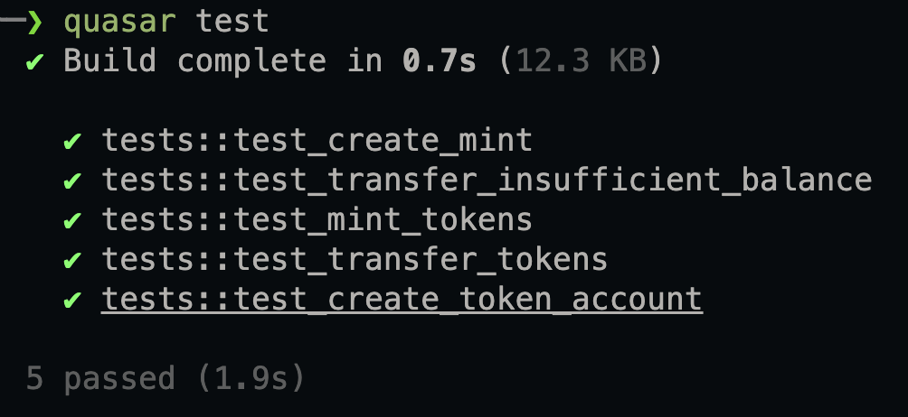

# Quasar SPL Token

A Solana program implemented using the Quasar framework for managing SPL tokens. This project demonstrates how to create mints, manage token accounts, mint tokens, and perform transfers using Quasar's high level abstractions.

## Program Address

The program is deployed at the following address on Solana:
```
7oY3XcwXGnonxNs92FrnR7e1Dtvf8pRLExvDgznzWTyU
```

## Tests Results


## Project Structure

The codebase is organized into modular components for clarity and maintainability:

* src/lib.rs: The main entry point of the program defining the instruction handlers.
* src/instructions/: Contains the implementation logic for each program instruction.
    * create_mint.rs: Logic for initializing a new SPL Token mint.
    * mint.rs: Logic for minting new tokens to a token account.
    * token_account.rs: Logic for creating new token accounts.
    * transfer.rs: Logic for transferring tokens between accounts.
* src/tests.rs: Integration tests for the program using the Quasar SVM testing framework.

## Instructions

The program supports the following core operations:

1. Create Mint: Initializes a new SPL Token mint with specified parameters.
2. Create Token Account: Sets up a new token account for a specific mint and owner.
3. Mint Tokens: Authorizes the minting of a specific amount of tokens to a destination account.
4. Transfer: Safely moves tokens from a source account to a destination account.

## Development and Testing

This project uses the Quasar framework for development and Quasar SVM for testing.

To build the project:
quasar build

To run the tests:
quasar test

## Requirements

* Rust toolchain
* Quasar CLI
* Solana CLI tools (optional for deployment)

## NOTE : 

There is no way to generate IDL in quasar for now , I didnt found another way to deploy the IDL.
